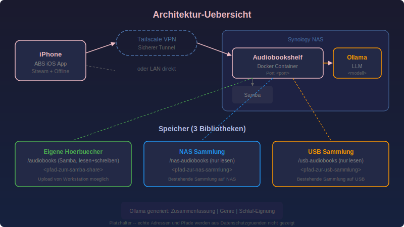
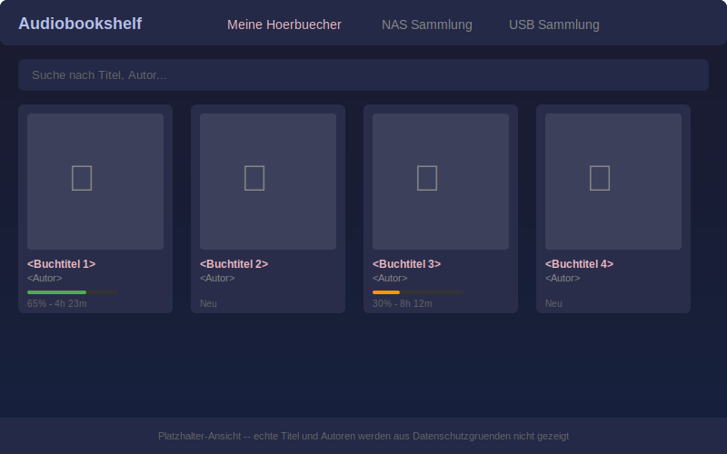
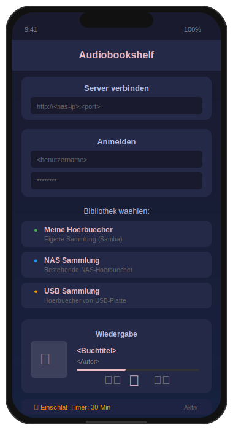
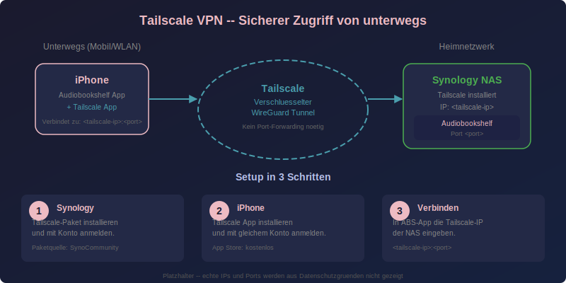

# Audiobookshelf - Deutsche Hoerbuch-Sammlung

Selbst gehosteter Hoerbuch-Server auf Synology NAS mit KI-gestuetzter Metadaten-Anreicherung fuer deutsche Hoerbuecher.

## Features

- **3 Bibliotheken**: Eigene Sammlung (Samba, r/w), NAS-Sammlung (ro), USB-Sammlung (ro)
- **iPhone Streaming** ueber die native iOS-App
- **Tailscale VPN** fuer sicheren Zugriff von unterwegs (kein Port-Forwarding noetig)
- **Einschlaf-Timer** mit sanftem Ausblenden
- **KI-Metadaten** ueber Ollama (Zusammenfassung, Genre, Einschlaf-Eignung)
- **Offline-Download** fuer Hoeren ohne Netzwerk

## Architektur



## Bibliotheks-Ansicht



## iPhone App & Wiedergabe



## Tailscale VPN Setup



## Dokumentation

- [Administrationshandbuch](ADMIN_HANDBUCH.md) -- Installation, Konfiguration, Bibliotheken, Tailscale, Wartung
- [Benutzerhandbuch](BENUTZER_HANDBUCH.md) -- iPhone-App, Tailscale-Setup, Einschlaf-Timer, Bedienung

## Schnellstart

```bash
# .env aus Vorlage erstellen und anpassen
cp .env.example .env
nano .env

# Container starten
docker compose up -d

# Metadaten via Ollama anreichern
python3 enrich_metadata.py --dry-run   # Vorschau
python3 enrich_metadata.py             # Ausfuehren
```

## Technologie-Stack

| Komponente | Beschreibung |
|---|---|
| [Audiobookshelf](https://www.audiobookshelf.org/) | Self-hosted Audiobook Server |
| [Ollama](https://ollama.ai/) | Lokale KI fuer Metadaten-Generierung |
| [Tailscale](https://tailscale.com/) | WireGuard-basierter VPN-Tunnel |
| Docker Compose | Container-Orchestrierung auf Synology |

---

*Alle Screenshots und Diagramme zeigen nur Platzhalter -- keine echten Titel, Autoren, IPs oder Pfade.*
